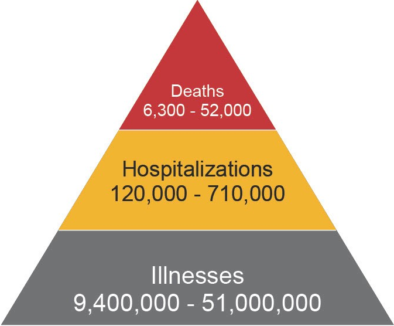
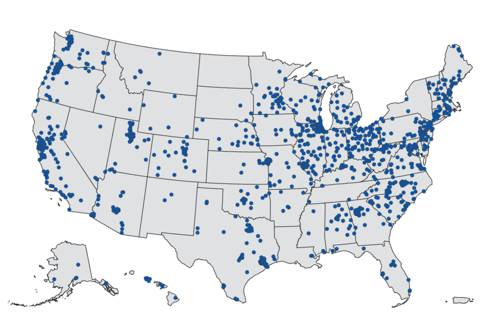

```{r setup, include=FALSE}
knitr::opts_chunk$set(echo = FALSE)

pacman::p_load(tidyverse, 
               ggplot2, 
               tsibble,
               slider,
               fable,
               feasts,
               Kendall,
               mgcv,
               knitr
               )
```
# Introduction

## What is Respiratory Syncytial Virus (RSV)?

Respiratory syncytial virus (RSV) is a RNA virus belonging to the *Pneumoviridae* family of viruses. Similarly to other common respiratory diseases, RSV infection is most often accompanied by (CDC):

* Difficulty breathing
* Coughing
* Sneezing
* Congestion
* Decreased appetite

as well as less common symptoms, which usually appear in infants, young children, and older adults:

* [Bronchiolitis](https://www.mayoclinic.org/diseases-conditions/bronchiolitis/symptoms-causes/syc-20351565)
* [Pneumonia](https://www.mayoclinic.org/diseases-conditions/pneumonia/symptoms-causes/syc-20354204)

Like many other seasonal viruses, RSV starts in the fall in the United States, peaking in the winter (usually around January to February) before case numbers lower as spring approaches.

## Why is RSV significant?

Worldwide, RSV is a leading cause of acute lower respiratory infections among both children and elderly. In the United States alone, it was estimated to cause between 60,000 and 160,000 hospitalizations as well as 6,000-10,000 deaths annually among adults aged 65 and over (NCBI 1).

RSV is highly contagious, and often difficult for providers to distinguish from other common respiratory viruses including:

- Common cold (rhinovirus)
- Flu (influenza)
- COVID-19

``` {r flu_burden, fig.cap = "Figure 1. Estimated range of annual flu burden from 2010-2025 obtained from https://www.cdc.gov/flu-burden/php/about/index.html"}



```

According to this chart, the hospitalization rate for RSV may be between 2 - 4.4 times lower than influenza, while the mortality rate may be between 1.05 - 5.2 times lower than influenza. Despite RSV being not too much different in prevalence from the flu, it often goes undiagnosed due to similar symptoms.

More consideration should be given to RSV, since it shares similar mortality rate to the flu yet has higher rates of pneumonia, hospitalization, and extended hospital stays (NCBI 2). Lowering the incidence of RSV would improve health outcomes for at-risk populations and reduce costs associated with prolonged hospital stays.

## Measuring RSV

Multiple limitations exist within the United State's RSV reporting systems in place.

Nationwide testing surrounding RSV remains minimal, complicating the process of data aggregation. There is not yet a central RSV-surveillance system in place nationwide, leading to large gaps of coverage in certain states. 

RSV-NET (RSV-Hospitalization Surveillance Network) is a CDC-led program that monitors laboratory-confirmed RSV hospitalizations. Established in 2018, this program serves 14 states (found [here](https://www.cdc.gov/resp-net/dashboard/)) and over 170 counties. NREVSS (National Respiratory and Eneteric Virus Surveillance System) measures RSV since 1989 through labs who voluntarily report positive RSV tests weekly. While generally more comprehensive, the data obtained through NREVSS is still subject to undercoverage bias.

## RSV in Vermont

``` {r NREVSS_dash, fig.cap = "Figure 2. The CDC NREVSS Dashboard of the week ending April 25, 2026 obtained from https://www.cdc.gov/nrevss/php/dashboard/index.html"}

include_graphics("figures/rsv_quintiles.png")

```
As of late April 2026, Vermont had one of the highest concentrations 


Had to use pcr_target_avg_conc rather than pcr_target_flowpop_lin because too much data was missing

Population differences are small enough to accomodate this decision.

# Methods

### Wastewater Surveillance

The CDC collects data reported by state and local health departments through the National Wastewater Surveillance System (NWSS) supported by funding through the Epidemiology and Laboratory Capacity for the Prevention and Control of Emerging Infectious Diseases Cooperative Agreement (10).


``` {r NWSS_sites, fig.cap = "Figure 3. United States NWSS Sites reporting RSV concentrations as of May 14, 2025 obtained from https://www.cdc.gov/wastewater/about/index.html?cove-tab=3"}



```

Sites are selected by local governments to increase wastewater surveillance and population coverage. Many health departments prioritize enrolling sites with a high social vulnerability index to better represent vulnerable populations who may be underrepresented in clinical tests for respiratory viruses. 89% of sites are located at a wastewater treatment plan(12).

Wastewater collection differs between sites. Some sites may sample untreated wastewater (sewage and stormwater) or primary sludge (suspended solids from wastewater). Sampling methods also differ, including grab samples (from a point in time) or composite samples (aggregated grab samples). Sampling frequency also differs between sites (12). For each sample, various metrics are recorded including flow rate, virus type, viral quantification, and contamination measurements. Each site is also associated with a region and population served (11, 12). Viral quantification is measured using repeated PCR tests. All data is then submitted to the CDC.

### Analytic Methods

Data cleaning, analyses, and visualizations were conducted using R (version 4.5.2; R Foundation). Prior to in-depth analysis, data cleaning and exploratory visualization was performed. During this step a 7-day rolling average concentration was calculated for each data point to reduce noise and artifacts.

``` {r clean_data, include=FALSE}
vt_rsv <- 
  read.csv("CDC_RSV_Wastewater_Data.csv") |>
  
  select(site, counties_served, sample_collect_date, pcr_target, pcr_target_avg_conc, population_served) |>
  
  filter(pcr_target == 'rsv',
         site != '1962') |> 
  
  # Since we filtered for pcr_target == RSV, we can drop the pcr_target column
  select(-pcr_target) |> 
  
  rename(county = counties_served,
         date = sample_collect_date,
         rsv_conc = pcr_target_avg_conc) |> 
  
  mutate(date = ymd(date), # date
         rsv_conc = as.numeric(gsub(",", "", rsv_conc)), # convert to a numeric column
         county = as.factor(county), # convert to a factor
         site = as.factor(site), # convert to a factor
         facet_label = paste0("Site ", site, ": ", county, " county")) # create a title column

```

``` {r rolling_avg, include=FALSE}

# Calculate the rolling average column for data visualization

vt_rsv <-
  vt_rsv |> 
  
  group_by(site) |> # group by site for calculating rolling average
  
  arrange(date, .by_group = TRUE) |> # arrange by date for calculating rolling average
  
  mutate(mean_7day = slide_index_dbl(
           .x = rsv_conc,
           .i = date,
           .f = ~mean(.x, na.rm = TRUE),
           .before = days(6)
         )) |> # create the rolling average column
  
  ungroup() # ungroup the data

```

```{r exploratory_analysis}

exploratory <- 
  ggplot(
    data = vt_rsv
  ) +
  geom_line(
    mapping = aes(
      x = date,
      y = rsv_conc
      )#,
    #width = 1
  ) +
  geom_line(
    mapping = aes(
      x = date,
      y = mean_7day,
      color = site
    )
  ) +
  theme() +
  theme_minimal() +
  facet_wrap(
    facets = vars(facet_label),
    ncol = 2,
    scales = 'free_y'
  ) + labs(
    title = "RSV Wastewater Concentrations in Vermont",
    y = "RSV Concentration",
    x = "Date",
    color = "Site number",
    caption = "Source: CDC National Wastewater Surveillance System"
  )
```

#### Peak Comparison

After data cleaning and exploratory analysis (Figure A), peak analysis was performed to identify per-site and per-season factors. Samples were grouped by respiratory virus season (October through May). Season boundaries were defined empirically using wastewater concentration thresholds. Season onset was defined as the first sample date with a concentration greater than the baseline of 0 following an off-season period, while season conclusion was defined as the last sample date with a concentration of 0 following an on-season period. Per site, seasons were compared using elapsed days since season onset to allow for peak comparison across seasons. 

Peak years were calculated as the year containing the highest RSV concentration across the entire data set (Table 3)

JUNE 1ST

``` {r seasonal_cols, include=FALSE}

vt_rsv <- 
  vt_rsv |> 
  
  # Add a season column
  mutate(
    season = case_when(
      month(date) %in% 10:12 ~ paste0(year(date), "_", year(date)+1),
      month(date) %in% 1:5 ~ paste0(year(date)-1, "_", year(date)),
      TRUE ~ "off-season"
    ),
    starting_year = case_when(
      month(date) %in% 6:12 ~ year(date),
      month(date) %in% 1:5 ~ year(date) - 1,
    ),
  ) |> 
  
  # Add more info about that season
  mutate(
    # Add a column for the start and end date of that season
    start_of_szn = min(date[rsv_conc > 0 & season != 'off_season'], na.rm = TRUE),
    end_of_szn = max(date[rsv_conc == 0 & season != 'off_season'], na.rm = TRUE),
    # Add a column for days since the start of that season
    days_since_start_of_szn = if_else(
      season != 'off-season' & rsv_conc > 0,
      as.numeric(date - start_of_szn),
      as.numeric(NA)
      ),
    days_since_prev_off_szn = date - make_date(year = starting_year, month = 6, day = 1),
    .by = c(season, site)
  )

```

``` {r plot_seasonal_peaks}

# Graph offset between seasons
seasonal_offset <- 
  ggplot(
    data = vt_rsv
  ) +
  geom_line(
    mapping = aes(
      x = days_since_prev_off_szn,
      y = mean_7day,
      color = season
    )
  ) +
  theme_minimal() +
  facet_wrap(
    facets = vars(facet_label),
    ncol = 2,
    scales = 'free_y'
  )

# Seasonal data by days since start of season
seasonal_peaks <- 
  ggplot(
  data = vt_rsv
) +
  geom_line(
    mapping = aes(
      x = days_since_start_of_szn,
      y = mean_7day,
      color = season
    )
  ) +
  theme_minimal() +
  facet_wrap(
    facets = vars(facet_label),
    ncol = 2,
    scales = 'free_y'
  )

```

``` {r create_tables, include=FALSE}

# Compare peak days across sites and seasons
peak_days <- 
  vt_rsv |> 
  summarise(
    peak_day = start_of_szn[which.max(mean_7day)] + days(days_since_start_of_szn[which.max(mean_7day)]),
    .by = c(season, site)
  ) |> 
  filter(season != 'off-season') |> 
  pivot_wider(
    names_from = site,
    values_from = c(peak_day)
  ) 

# Add the average row
peak_days <- 
  peak_days |>
  bind_rows(
    peak_days |> 
      summarise(
        across(
          where(is.Date),
          ~ mean(.x, na.rm = TRUE)
        )
      ) |> 
      mutate(
        site = "average"
      )
  )
  

# Compare peak year for each site
peak_year <- 
  vt_rsv |> 
  summarise(
    year = season[which.max(mean_7day)],
    .by = c(site)
  )

# Mean season lengths across sites
szn_lengths <- 
  vt_rsv |> 
  summarise(
    szn_length = end_of_szn[which.max(mean_7day)] - start_of_szn[which.max(mean_7day)],
    .by = c(season, site)
  ) |> 
  filter(season != 'off-season') |> 
  group_by(season) |> 
  pivot_wider(names_from = site,
              values_from = szn_length,
              id_cols = season) |> 
  rowwise() |> 
  mutate(avg = round(mean(c_across('1965':'2350'), na.rm = TRUE), digits = 2)) |> 
  ungroup()

```

#### Seasonal Decomposition

``` {r seasonal_decomposition_func, include=FALSE}

seasonal_decomposition <- function(site_num) {
  dcmp <- 
    vt_rsv |> 
    filter(site == site_num) |>
    select(date, rsv_conc) |>
    mutate(week = floor_date(date, 'week'), # Change dates to per week
           rsv_conc = log1p(rsv_conc)) |> # Transform rsv_conc by log
    group_by(week) |> 
    summarise(weekly_mean = mean(rsv_conc, na.rm = TRUE)) |> # Create weekly mean
    as_tsibble(index=week) |> # Convert to tsibble
    fill_gaps() |> 
    mutate(
      weekly_mean = replace_na(weekly_mean, 0)
    )
  
  return(dcmp)
}

```

To measure overall trends across each site, seasonal decomposition was used to decompose the trend into its trend-cycle, seasonal, and remainder components. Only the three sites containing consistent data spanning *$n \qe 3$* years (sites 1965, 1966, and 1975) were used for decomposition to reliably observe a trend spanning multiple years.

``` {r seasonal_decomposition, include=FALSE}

# Get seasonal decomposition for the three compatible sites
site_1965 <- seasonal_decomposition('1965') |> 
  model(stl = STL(weekly_mean)) |>  # Fit model
  ungroup()

site_1966 <- seasonal_decomposition('1966') |> 
  model(stl = STL(weekly_mean)) |>  # Fit model
  ungroup()

site_1975 <- seasonal_decomposition('1975') |> 
  model(stl = STL(weekly_mean)) |>  # Fit model
  ungroup()

```

``` {r get_decomposition_peaks, include=FALSE}

# Extract_decomposition_peaks returns the peak weeks for a site
# from seasonal decomposition

extract_decomposition_peaks <- 
  function(site) {
    
    decomp_peaks <- 
      components(site) |> 
      
      index_by(year = ~ year(.)) |> 
      
      summarise(
        week_max = week[which.max(season_year)], # Get the peak week per season
        max_season_year = max(season_year, na.rm = TRUE) # Get the value of the max peak
        )
    
    return(decomp_peaks)
  }

```

``` {r get_peaks_from_decomposition, include=FALSE}

decomp_peaks_1965 <- 
  extract_decomposition_peaks(site_1965)
  
decomp_peaks_1966 <- 
  extract_decomposition_peaks(site_1966)

decomp_peaks_1975 <- 
  extract_decomposition_peaks(site_1975)

```

``` {r ymd_to_md, include=FALSE}

# Peak_as_month_date takes a decomp_peaks_(site number) and returns the mean peak date
# as a month-date format

peak_as_month_date <- 
  function(peaks) {
  
    max_weeks <- 
      (peaks |> 
         
         filter(
           year != 2023 # Filter out 2023 with truncated data
           ) |> 
         
         mutate(
           week_max = make_date(
             year = case_when(
               month(week_max) < 6 ~ 2024, # Standardize year for the sake of averaging
               month(week_max) > 6 ~ 2023
             ), 
             month = month(week_max), # Keep the month and date
             day = day(week_max)
             )
           )
       )$week_max # Extract only the week_max
    
    mean = mean(max_weeks) # Calculate the mean peak date
    
    return(format(mean, "%m-%d"))
  }
```

Per site and season, dates were grouped by week and averaged to create the continuous, regular time intervals required for this method. Gaps were filled with *Concentration = 0* for *n = 3* weeks for site 1966 for the weeks of April 21, 2024; April 28, 2024; and May 5; 2024 due to missing data. Prior to decomposition, RSV concentrations were transformed by natural log to normalize the skew in the data and convert the multiplicative decomposition into additive decomposition.

#### Generalized Additive Model (GAM)

A general additive model (GAM) was used to model the relationship between date and wastewater RSV concentrations over time, per site. As with seasonal decomposition, the same *n = 3* sites were used (1965, 1966, 1975) to provide enough data to build the model. Furthermore, the RSV concentrations were again transformed by natural log.

- used weekly mean log

- used smoothing spline

- chose bs = cc for cyclic smoothing spline

# Results

### Exploratory Analysis

An initial overview of the data sought to visualize early patterns to note trend and seasonal observations, compare sites, and identify any initial limitations of further analysis.

``` {r visualize_exploratory}
exploratory
```

Exploratory visualizations revealed clear seasonal patterns around sites consistent with known information surrounding RSV epidemiology. Concentrations begin to increase in the Fall and peak typically in January or February before declining again in April to May. This pattern was consistent across all sites. Only sites 1965, 1966, and 1975 contained three full seasons worth of data, providing enough data for further statistical tests (seasonal decomposition and GAM).

### Peak analysis 

``` {r visualize_seasonal_offset}

seasonal_offset

```

Comparison of seasonal peak offsets reveal generally seasons occurring earlier in the study period exhibit earlier onset of RSV concentration increases. The 2023-2024 season rises and peaks early in sites 1965, 1966, and 1975 before the 2024-2025 and 2025-2026 seasons rise. Peaks in the latter seasons appear to be between 30-50 (**QUANTIFY THIS**) days later than peaks in the 2023-2024 season. Data for site 2350 also supports this trend, excluding an early spike in concentration during the 2025-2026 season. Site 1976 maintains fairly similar peaks between the 2024-2025 season and the 2025-2026 season.

``` {r visualize_seasonal_peaks}

seasonal_peaks

```
A total of *n = 4* disjoint respiratory virus seasons were observed among the six sites. Only sites 1965 and 1975 report on all *n = 4* seasons, including truncated data from the 2022-2023 season. Site 1966 excludes data from the 2022-2023 season and reports on the following seasons.

Sites 1965, 1966, and 1975 report high spikes in RSV concentration during mid-late season 2023-2024. Excluding sites 1976 and 2350, RSV concentrations seem to be highest overall in the 2023-2024 and 2025-2026 seasons.

#### Season Info {.tabset}

##### Season lengths

Table 1

``` {r season_lengths}

szn_lengths |> 
  kable()

```

The 2023-2024 season was the longest season on average of the last three years.

##### Season peaks

Table 2

``` {r peak_day}

peak_days |> 
  kable()

```

In the 2022-2023, 2023-2024, 2024-2025 and 2025-2026 seasons the most common peak ranges were March, February, February, and late February.

##### Peak years

Table 3

``` {r peak_year}

peak_year |> 
  kable()

```


### Seasonal decomposition

Seasonal decomposition was used to measure three core components of the time series trend observed:

$$ y_t = S_t + T_t + R_t $$
$y_t$ = Time series data

$S_t$ = The **seasonal component** shows the seasonal pattern occurring over time.

$T_t$ = The **trend-cycle component** shows the overall movement of the data over the time series.

$R_t$ = The **remainder** component explains the difference between $y_t$ and $S_t + T_t$.

at time period *t*

``` {r show_seasonal_decomposition}

# Graph seasonal decomposition for site 1965
components(site_1965) |> 
  autoplot() +
  labs(
    title = "STL Decomposition of RSV Wastewater Concentration",
    subtitle = "Site 1965: Chittenden County, VT",
    caption = "Source: CDC National Wastewater Surveillance System"
  ) +
  theme_minimal()

# Graph seasonal decomposition for site 1966
components(site_1966) |> 
  autoplot() +
  labs(
    title = "STL Decomposition of RSV Wastewater Concentration",
    subtitle = "Site 1966: Chittenden County, VT",
    caption = "Source: CDC National Wastewater Surveillance System"
  ) +
  theme_minimal()

# Graph seasonal decomposition for site 1975
components(site_1975) |> 
  autoplot() +
  labs(
    title = "STL Decomposition of RSV Wastewater Concentration",
    subtitle = "Site 1975: Washington County, VT",
    x = "Week",
    caption = "Source: CDC National Wastewater Surveillance System"
  ) +
  theme_minimal()
```

For sites 1965, 1966, and 1975 over the last three years, seasonal peaks occur on averange on `r peak_as_month_date(decomp_peaks_1965)`, `r peak_as_month_date(decomp_peaks_1966)`, and `r peak_as_month_date(decomp_peaks_1975)` respectively.

Site 1965 shows a dip in the overall trend of the data during summer 2024. From there the trend continues to increase steadily throughout 2025 and early 2026, where it is currently highest. Site 1966 rises steadily peaks during the 2023-2024 respiratory virus season and has steadily decreased since. Site 1975 also exhibits a dip in the data during the summer of 2024 before peaking again during respiratory virus season 2024-2025 and has steadily declined since then. All sites showed a clear seasonal cycle with a fluctuating long term trend.

Observing seasonal decomposition, we can see after separating the data for site 1965 into the trend, seasonal, and remainder components that the overall trend is increasing for the 2026 season. For site 1966, since early 2024 the overall trend has remained about constant. For site 1975, the trend dramatically decreases during the summer months and is still approaching its peak for the 2025-2026 season.

```{r to_gam_format}

to_gam <- 
  function(site_num) {
    vt_rsv |> 
    filter(site == site_num) |> 
    mutate(
      first_date = min(date),
      days_elapsed = as.numeric(date - first_date),
      day_of_year = yday(date),
      weekly_mean_log = log1p(mean_7day)
    )
  }

```


```{r gam}

site_1965_for_gam <- to_gam('1965')
site_1965_for_gam
site_1966_for_gam <- to_gam('1966')
site_1975_for_gam <- to_gam('1975')

# Fit gam for site 1965
gam_1965 <- gam(
  weekly_mean_log ~ s(days_elapsed) + s(day_of_year, bs = 'cc'),
  data = site_1965_for_gam,
  method = 'REML'
)

# Fit gam for site 1966
gam_1966 <- gam(
  weekly_mean_log ~ s(days_elapsed) + s(day_of_year, bs = 'cc'),
  data = site_1966_for_gam,
  method = 'REML'
)

# Fit gam for site 1975
gam_1975 <- gam(
  weekly_mean_log ~ s(days_elapsed) + s(day_of_year, bs = 'cc'),
  data = site_1975_for_gam,
  method = 'REML'
)

summary(gam_1965)
summary(gam_1966)
summary(gam_1975)

plot(gam_1965, pages = 1, residuals = TRUE)
plot(gam_1966, pages = 1, residuals = TRUE)
plot(gam_1975, pages = 1, residuals = TRUE)

```
The general additive model sums a smoothing spline of days elapsed since March 3, 2023 to a smoothing cyclic cubic spline of the day of the year. For all three sites, data was consistent.

The long-term trend component (days elapsed) shows peaks corresponding to the 2023-2024 and 2024-2025 winter seasons with dips during the summer seasons. The rise towards the right edge of the graph represents the current 2025-2026 season. Towards the edge of the graph the confidence interval widens significantly.

The seasonal component shows a peak in RSV concentrations within the first fifty days of the year, with a sharp decrease that bottoms out around mid-July. Concentrations begin to rise again gradually, before sharply increasing beginning in late October.

For all sets of graphs, confidence intervals tend to widen during the summer months.

# Limitations

A few of the sites used for analysis had gaps in data. Site 1967 only has data for the present 25-26 season, while sites 1976 and 2350 have data for the 25-26 season and the 24-25 season. Site 1976 also has artifacts from the 23-24 season. For this reason, only the three sites with at least three full years of data (1965, 1966, and 1975) were seasonally decomposed and tested using GAM.

A known limitation of the data according to collection methods are that different sampling locations may be collected at different frequencies and different laboratory methods. As such, it was not advised to compare wastewater concentrations across sites. Therefore we will only compare relative trends across sites.

2022-2023 season sucks
some sites don't report all the data
no hospitalizations 
data only covers 4 years maximum which really isn't enough

# Discussion

RSV epidemiology follows a consistent seasonal pattern across the six reporting sites in Vermont from 2023-2026. At a very low p value of <2e-16 [ INSERT CODE HERE SO THIS IS DYNAMIC] (less than machine epsilon) we can reject H0 with overwhelmingly strong evidence at ⍺ = 0.05 and conclude that there is a meaningful non-linear relationship in the data between weekly concentrations and the day of the year.

For the 2025-2026 respiratory virus season, the CDC estimated peak hospitalizations for RSV would be very similar to last year’s, the 2024-2025 season (13). RSV surveillance is limited to wastewater monitoring and positive test results, which focus on infectivity rather than pathogenicity. Hospitalizations better model pathogenicity as ~80% of RSV infections are classified as moderate or mild (14), however infectivity may be a better measure of disease distribution.

As of late April 2026, the NREVSS dashboard suggested Vermont had one of the highest RSV concentrations in the country this late into the season. Two possibilities stuck out as causes for this:

1. Vermont's 25-26 season has exhibited abnormally high RSV concentrations.
2. Vermont's 25-26 season has peaked later than other states this year.

## Viral Distribution Profile

The first aim of this study was to investigate the overall trend for each site and determine if RSV concentrations were statistically significantly higher for the 25-26 season compared to previous seasons. The CDC's respiratory illnesses data channel states RSV burden is no more severe this season compared to previous seasons nationwide (15).

Initially, exploratory analysis corroborated this fact. Most earlier seasons exhibited higher peaks per site than the current season, suggesting this season is well within normalcy. Only sites 1967, 1975, and 2350 peaked in 2025-2026 (Figure 3), yet only site 1975 had enough data to observe a trend. These visual peaks were corroborated by peak analysis (Figure 4,5 ; Table 3). Seasonal decomposition for the three significant sites showed neither sites 1966 nor 1975 exhibited significant increases in the overall trend, suggesting RSV concentrations were within an expected range for this season.

Site 1965's overall trend of RSV concentrations this year increased and reached a new maximum. The trend time portion of the GAM model for this site also suggests this season showed an increase in RSV concentrations, suggesting site 1965 in Chittenden county did show an abnormal increase in RSV wastewater concentrations this year.

## Temporal Shifts

The second aim of this study was to identify possible delayed onset in the current RSV season in Vermont. As of May 15, 2026, the CDC maintains that RSV activity began later than expected in most regions of the US (15).

Initial exploratory analysis provided no immediate insights into any temporal shift, however peak analysis quickly visualized an offset. For every site except 1967 (due to the aforementioned limitation) and 1976, RSV concentrations started increasing later than previous seasons and peaked later than earlier seasons. Peaks occurred around fifty days later this year among sites 1965, 1966, 1975, and 2350 (Figure 5). Figure 6, which compares peaks across sites and seasons by days since the start of the season, reveals the seasonal trend was not significantly different.

Peak days in the 25-26 season were significantly later than peaks in the 23-24 and 24-25 seasons, excluding site 1976. On average, peaks were around a month later this year (Table 2). Site 2350 exhibited its highest peak on May 5th this year, which shows the extent of this as no site peaked in April or May in the last few years.

Showing the season was offset

- GAM peaks in seasonal corroborate the peaks

# Considerations
- what else could lead to site 1965 showing increased concentrations this year?
- what did vaccinations look like this year? were schedules extended? how did recommendations change?
- this season is lasting longer, so season lengths could still be compared (Table 1)
- why is site 1976 different 


## Sources

https://www.cdc.gov/rsv/about/index.html

1. https://pmc.ncbi.nlm.nih.gov/articles/PMC11946814/
2. https://pubmed.ncbi.nlm.nih.gov/38574192/

https://www.cdc.gov/rsv/php/surveillance/rsv-net.html

https://www.who.int/news-room/fact-sheets/detail/respiratory-syncytial-virus-(rsv)

https://www.mayoclinic.org/diseases-conditions/bronchiolitis/symptoms-causes/syc-20351565

https://www.mayoclinic.org/diseases-conditions/pneumonia/symptoms-causes/syc-20354204

https://otexts.com/fpp3/components.html

10. https://data.cdc.gov/Public-Health-Surveillance/CDC-Wastewater-Data-for-RSV/45cq-cw4i/about_data

11. https://www.cdc.gov/wastewater/about/index.html

12. https://pmc.ncbi.nlm.nih.gov/articles/PMC11103741/

13. https://www.cdc.gov/cfa-qualitative-assessments/php/data-research/season-outlook25-26.html

14. Belongia EA, King JP, Kieke BA, et al. Clinical Features, Severity, and Incidence of RSV Illness During 12 Consecutive Seasons in a Community Cohort of Adults ≥60 Years Old. Open Forum Infect Dis. 2018;5(12):ofy316. Published 2018 Nov 27. doi:10.1093/ofid/ofy316

15. https://www.cdc.gov/respiratory-viruses/data/


